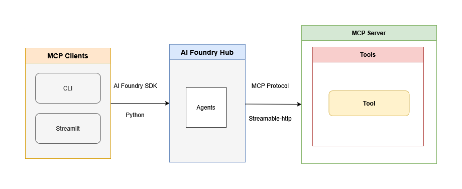

# AI Foundry Agent

The AI Foundry Agent integrates Azure AI Foundry with Snowflake services through the [Model Context Protocol (MCP)][mcp-foundry] using the [AI Foundry SDK][foundry-sdk]. 



The agent workflow consists of:

- **Configuration Loading** (`_load_config`): Loads agent settings from YAML and environment variables
- **Project Initialization** (`_project_init`): Establishes Azure AI Foundry client and MCP tool connections
- **Agent Management** (`_agent_init`): Creates or retrieves existing agents with MCP capabilities
- **Conversation Handling** (`_agent_run`): Processes user messages, manages tool approvals, and returns responses
- **Agent Cleanup** (`_agent_delete`): Removes agents when configured for disposal

The main entry point `invoke_agent()` orchestrates this workflow to enable AI agents to interact with Snowflake Cortex services.

## Setup

### Configuration Files

Rename template files to remove `_template` suffix:

```
agent_config_template.yaml → agent_config.yaml
ai_foundry_template.env → ai_foundry.env
```

### Environment Configuration

Configure `ai_foundry.env` with Azure AI Foundry settings:

```env
MODEL_DEPLOYMENT_NAME=<your-model-deployment>
PROJECT_ENDPOINT=<your-ai-foundry-endpoint>
```

### Agent Configuration

Configure `agent_config.yaml` with agent settings:

#### Agent Name Section
Each agent configuration is defined under a unique agent name (e.g., `snowflake-cortex-mcp`). This name serves as the identifier when invoking the agent and must match the `agent_name` parameter in `invoke_agent()`.

#### Configuration Parameters
- **Agent_Instruction**: System prompt defining agent behavior and capabilities
- **Agent_Description**: Brief description of the agent's purpose
- **MCP_Server_Label**: Identifier label for the MCP server connection
- **MCP_Server_URL**: Endpoint URL of your deployed MCP server
- **Auth_Token**: Bearer token for MCP server authentication (if required)
- **Allowed_Tools**: Array of specific tool names to enable (empty array = all tools allowed)
- **Approval_Mode**: Tool execution approval level (`always`, `never`, `prompt`)
- **Logging**: Enable/disable logging (`true`/`false`)
- **Log_Path**: File path for agent execution logs
- **Delete_Agent_After_Run**: Remove agent after each execution (`true`/`false`)
- **Ignore_Existing_Agent**: Create new agent even if one exists (`true`/`false`)

### Prerequisites

#### Azure AI Foundry Setup
1. **Create AI Foundry Hub**: Follow [AI Foundry hub setup guide][ai-foundry-hub-setup]
2. **Create AI Foundry Project**: Use [project creation guide][ai-foundry-project-setup] 
3. **Deploy Models**: Deploy required models using [model deployment guide][ai-foundry-model-deploy]
4. **Get Project Endpoint**: Obtain from project overview page - see [connection details][ai-foundry-connection-info]
5. **Get Model Deployment Name**: Find in project's model deployments section

#### Additional Requirements
- [Azure AI Foundry SDK][ai-foundry-sdk] installed
- [Azure authentication][azure-auth] configured (DefaultAzureCredential)
- Running MCP server instance

### Running as Standalone for Testing

Execute the agent directly for testing:

```bash
uv run ai-foundry-agent
```

This runs the `_main()` function with default configuration. To test with different parameters, modify the variables in the `_main()` function within `agent.py`:

```python
def _main():
    # Modify these values for testing
    agent_name = "Your Agent Name"  # Must match agent name in config
    user_message = "Your test message here"
    
    results = invoke_agent(agent_name, user_message)
    print(results)
```

<!-- Reference Links -->
[mcp-foundry]: https://learn.microsoft.com/en-us/azure/ai-foundry/agents/how-to/tools/model-context-protocol
[ai-foundry-hub-setup]: https://learn.microsoft.com/en-us/azure/ai-foundry/how-to/create-azure-ai-resource
[ai-foundry-project-setup]: https://learn.microsoft.com/en-us/azure/ai-foundry/how-to/create-projects
[ai-foundry-model-deploy]: https://learn.microsoft.com/en-us/azure/ai-foundry/how-to/deploy-models-openai
[ai-foundry-connection-info]: https://learn.microsoft.com/en-us/azure/ai-foundry/how-to/create-projects#find-your-project-details
[ai-foundry-sdk]: https://learn.microsoft.com/en-us/python/api/overview/azure/ai-projects-readme
[azure-auth]: https://learn.microsoft.com/en-us/python/api/overview/azure/identity-readme
[foundry-sdk]: https://learn.microsoft.com/en-us/azure/ai-foundry/how-to/develop/sdk-overview?pivots=programming-language-python